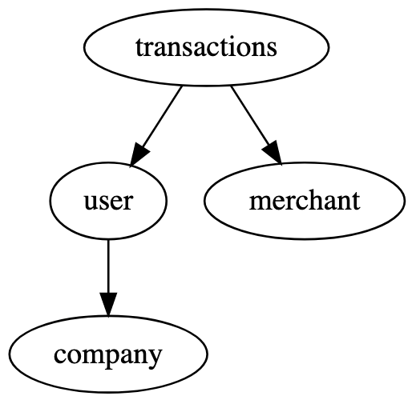
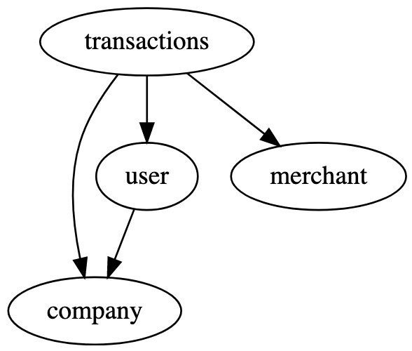

# Divvy Backend Homework Instructions

This repository provides a starting point for a basic React + GraphQL application.
All of the configuration boilerplate is complete so you can start by writing the code that you want us to see.

Please **fork** this repo to your GitHub account.

You do not need to complete the frontend assignments if you are planning to apply specifically for a backend role.

See the [README](https://github.com/DivvyPayHQ/web-homework/blob/master/elixir/README.md) for how to get elixir up and running. 

## Instructions

You do not have to complete all of these objectives, but do as many as you can without wasting your time.

For **senior engineers**, complete enough of the project to demonstrate your abilities as a senior.  This should be more than 3 objectives.  You can modify anything you need to with this project, so kick the tires and show us what you can do.

For **mid-level engineers**, complete any 3 objectives.

For **junior engineers** complete any 1 of these objectives and include a basic test or two.  These tasks are possible with limited or no prior knowledge of Elixir within a very short amount of time.

## Objectives

 * Write filtering options for transactions, users, and/or merchants. This could include:
 - [x] fuzzy searching for a user by first and last name
 - [x] fuzzy searching for a merchant by name
 - [x] getting back transactions with an amount between `min` and `max` arguments

 * Write a new schema, queries, and mutations to add companies to the app
  - [x] users should belong to a company and we should require transactions to pass in a company_id
      -  so i went a little off script with this one since I thought this:\
      \
      was better than this:\
       \
       since there are less redundancies 
  - [x] company should have a `name`, `credit_line`, and `available_credit` which would be the `credit_line` minus the total amount of `transactions` for the company
    - ask me about this one

  * Seed the database.  Possible solutions include:
   - [x] Implement provided `seeds.ex` file
   - [x] Write a `.sql` file that can be ingested by the database 
     - `pg_dump homework_dev > homework_sql`

  * Write tests for the resolvers & mutations.
   - [x] Testing that you can get information from the resolver queries
   - [x] Testing that you can get create/update/delete from the resolver mutations

  * Add a pagination layer to the queries
   - [x] should include a `limit` (how many rows to return) and `skip` (how many rows to skip) options
      - `limit` being `first` with `AbsintheRelay` and the cursor arguments `before` and `after` acting as a sort of `skip`
   - [ ] should return a `total_rows` (how many total rows exist)
   - [x] Bonus: Make it a wrapper that all the schemas can tap into.
       - I'm counting `AbsintheRelay` as a wrapper 

  * Allow the mutations to handle a decimal amount for transactions (the database stores it as cents)
   - [x] Mutations need to convert the Decimal amount to an Integer e.g. 24.68 becomes 2468
   - [x] The queries should convert the Integer amount to a Decimal e.g. 2468 becomes 24.68

## Bonus points
- [x] Find the bug with transactions
- [x] Find the security issue
  - no authentication?
- [ ] Add/improve the docs and @spec to functions
